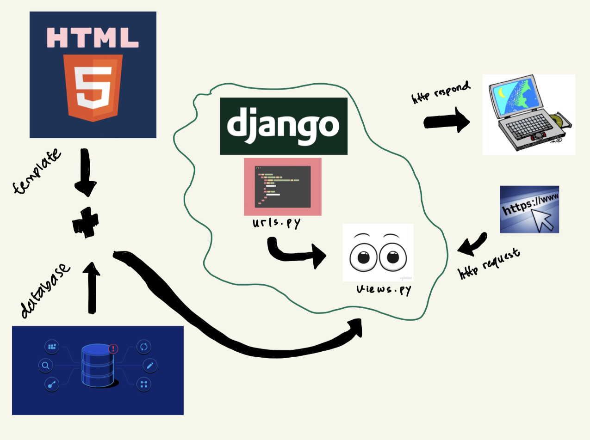
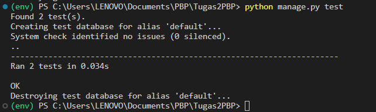
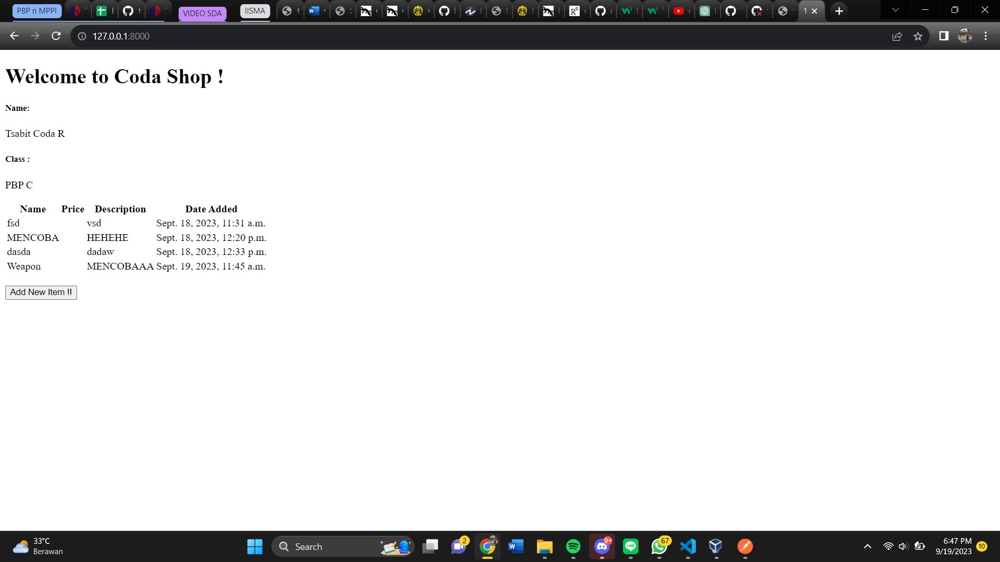
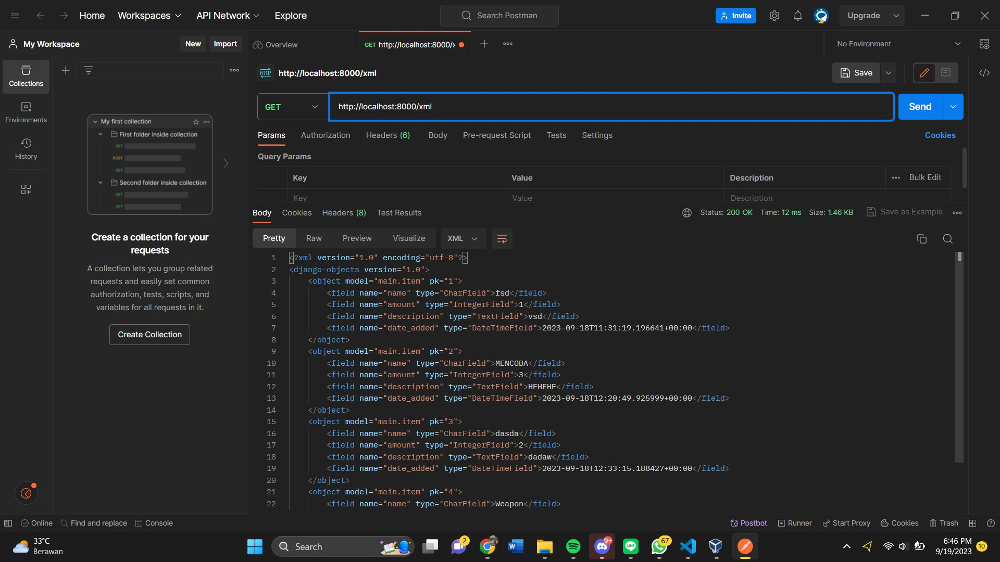
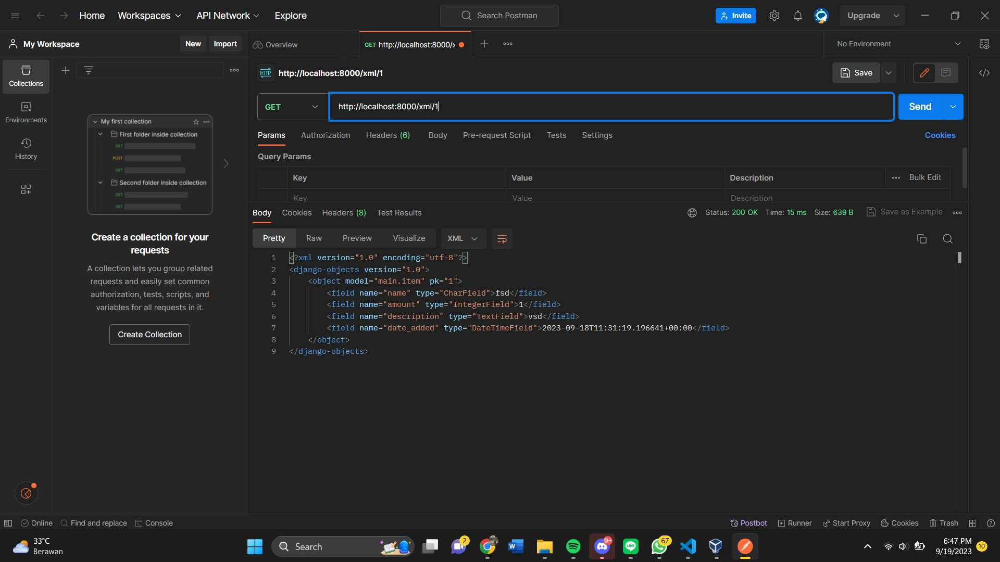
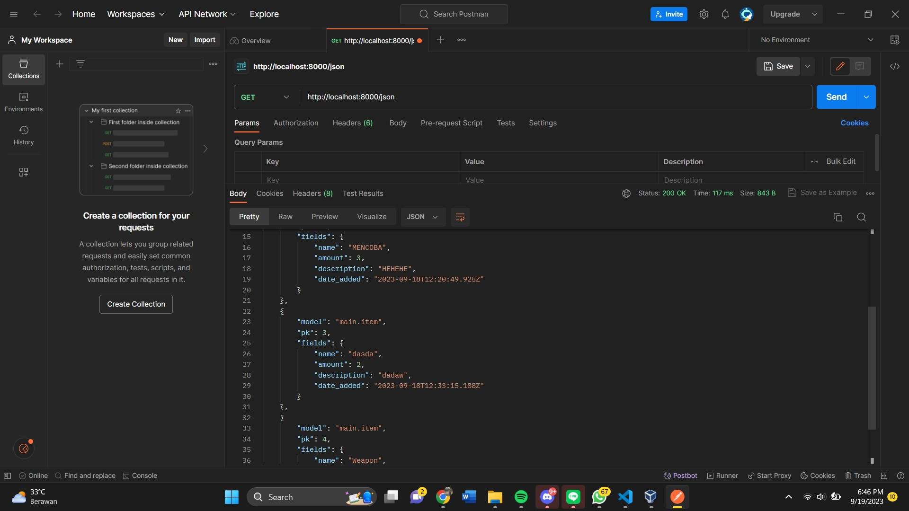
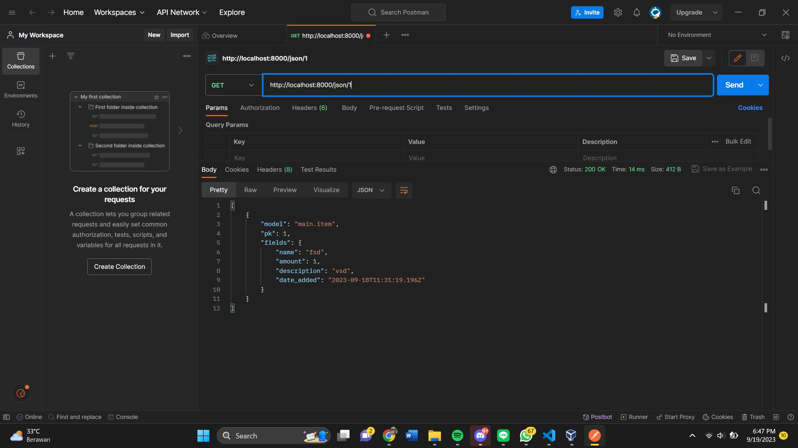
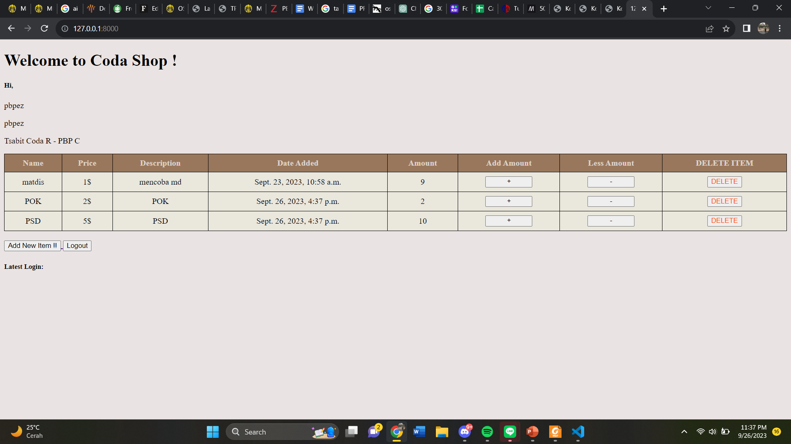
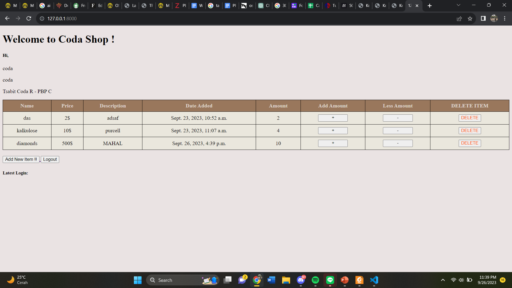

# TUGAS 2

# Cara Membuat Proyek Django
Membuat file `requirements.txt` yang akan diisi dengan hal-hal yang akan kita perlukan untuk didownload
```
django
gunicorn
whitenoise
psycopg2-binary
requests
urllib3
```
Setelah itu, kita coba download dengan menggunakan command :

1. `python -m venv venv` (untuk membuat virtual environment)

2. `env\Scripts\activate` (aktivasi virtual environment)

3. `pip install -r requirements.txt` (download isi dari requirements.txt)

Last step pada pembuatan proyek django adalah melakukan perintah `django-admin createproject <nama project kalian>`.

Perlu diperhatikan pula bahwa dalam direktori yang dibuat, akan terdapat file **manage.py** yang akan berfungsi sebagai pengatur code yang akan kita buat nanti.

Untuk memastikan berhasil/tidaknya step ini, kita dapat melakukan command `python manage.py runserver` dan kalian bisa klik `http://localhost:8000`

Jika terdapat gambar roket dan tulisan succesful, maka proyek django kalian **SUKSES DIJALANKAN**😁

# Cara Membuat dan Menjalankan Aplikasi
Tambahkan `*` pada `ALLOWED HOST` pada `settings.py` untuk mengizinkan akses untuk semua host agar memudahkan keperluan-keperluan.
```py
ALLOWED_HOSTS = ["*"]
```

Step pertama dalam pembuatan aplikasi yaitu menggunakan command `python manage.py createapp <nama app kalian>`.

Setelah itu, jangan lupa mendaftarkan aplikasi kalian dalam `settings.py` sehingga akan menjadi seperti :

```py
INSTALLED_APPS = [
    'django.contrib.admin',
    'django.contrib.auth',
    'django.contrib.contenttypes',
    'django.contrib.sessions',
    'django.contrib.messages',
    'django.contrib.staticfiles',
    '<nama app kalian>'
]
```
Untuk menjalankan aplikasi, diperlukan proses **ROUTING** terlebih dahulu melalui `urls.py` dalam folder main kalian menggunakan command : 

```py
from django.urls import path
from main.views import show_main

app_name = 'main'

urlpatterns = [
    path('', show_main, name='show_main'),
]

```

Function `show_main` pada code di atas bertujuan untuk mengakses modul `main.views` untuk menampilkan aplikasi kalian. 


Setelah itu, diperlukan proses **ROUTING** melalui `urls.py` dalam folder proyek untuk memetakan function  :

```python
from django.contrib import admin
from django.urls import path, include

urlpatterns = [
    path('admin/', admin.site.urls),
    path('<nama app kalian>', include('main.urls'))
]

```

Setelah ini, kalian akan dapat melihat tampilan aplikasi yang kalian buat dengan mengakses link `https://localhost:8000`.

# Melakukan Deployment Adaptable

Siapkan repository github kalian dan pastikan bersifat **PUBLIC**. Berlanjut ke Adaptable, kalian dapat klik `deploy a new app`  dan pilih repository github yang akan kalian deploy.

Setelah itu, kalian pilih `Python App Template`. Jika sudah masuk ke halaman database, kalian dapat memilih opsi `PostgreSQL`. Selanjutnya, kalian dapat cek versi dari python kalian menggunakan code dan masukan ke bagan `version`

```
python --version
```

Untuk mengisi bagan `command` , kalian dapat isi dengan `python manage.py migrate && gunicorn <nama proyek kalian>.wsgi`

# Bagan Request Client Web Django



Tahap - tahapnya :
1. Client akan melakukan **REQUEST** kepada django melalui pengisian url pada laman browser dan akan diterima oleh `urls.py` untuk dicocokan.

2. Jika `urls.py` menerima kecocokan, maka `urls.py` akan memanggil `views.py`.

3. Pada `views.py`, akan melakukan operasi database dan akan dipetakan pada `models.py`.

4. Pada `models.py`, akan dilakukan representasi dari `views.py` dan data-data yang direpresentasikan masih dapat diubah.

5. Setelah semua step-step sebelumnya berjalan, browser akan menerima respon website yang dapat client lihat.

# Why Virtual Environment ?!

Secara garis besar, penggunaan Virtual Environment didasari dari kemudahan dan efisiensi dalam melakukan proyek tertentu. Mengapa demikian? Berkat Virtual Environment, kita dapat mengerjakan beberapa proyek dengan depedensi tanpa konfilk.

Melalui hal tersebut, maka kita dapat mengelola depedensi yang diperlukan proyek secara terpisah dan menghindari adanya konflik yang akan terjadi.

**APAKAH TETAP BISA TANPA VIRTUAL ENVIRONMENT?**

Iya, bisa. Namun, mungkin lebih kompleks dan tidak akan mendapatkan kemudahan dari penjabaran sebelumnya.

## MVC? MVT? MVVM ?
1. MVC (Model View Controller) adalah sebuah design pattern yang memisahkan model, view, dan juga controller.
- Model : Mengatur dan mengelola database.
- View : Menampilkan GUI.
- Controller : Menyambungkan model dan view.

2. MVT (Model View Template) mirip dengan MVC hanya saja terdapat perbedaan dalam controller yang diimplementasikan langsung oleh framework. 
- Model : Mengatur dan mengelola database.
- View : Tempat pemrosesan permintaan dan berfungsi sebagai logic utama.
- Template : Tampilan.

3. MVVM (Model View ViewModel) adalah sebuah design patterpembuatan GUI yang memisahkan fokus antara tampilan aplikasi dan juga logic program.
- Model : Mengelola database dan logic aplikasi setelah menerima input dari view
- View : Representasikan UI.
- ViewModel : Penghubung model dan juga view.

## Bonus
Melakukan testing proyek django dengan melakukan perintah `python manage.py test` dan memgasilkan output :



<<<<<<< HEAD
# TUGAS 3

## GET vs POST (DJANGO)

1. **Tata cara pengiriman data**
- `Get` data form URL.
- `Post` data form HTTP dan bersifat sembunyi (tidak menggunakan URL).

2. **Benefit**
- `Get` dapat menggunakan bookmark karena based on URL.
- `Post` tidak dapat menggunakan bookmark karena tidak based on URL.

## Perbedaan XML, JSON, AND HTML

1. **Function**
- `HTML` membuat tampilan halaman web atau dapat dikatakan sebagai kerangka web.
- `JSON` menyimpan dan mengirimkan data dengan format data yang mudah dimengerti.
- `XML` menyimpan dan mengirimkan data dengan format data self-descriptive.

2. **Struktur**
- `HTML` membuat tampilan halaman web(heading, picture, paragpraph, and much more)
- `JSON` menyimpan data dengan format key:value and nested
- `XML` menyimpan data dengan format tree structure (parent child relationship)

3. **Syntax**
- `HTML` dan `XML` menggunakan tags
- `JSON` menggunakan key:value

## MENGAPA JSON DIGUNAKAN SEBAGAI PERTUKARAN DATA ANTARA APLIKASI WEB MODERN ?

1. **Lebih readable**
Hal ini dikarenakan syntax `JSON `tidak memerlukan tag ataupun atribut khusus sehingga `JSON `lebih readable dan lebih efektif dalam penggunaanya

2. **General data type**
`JSON `memiliki kelebihan yaitu mendukung berbagai jenis data type yang dapat berbentuk nested

3. **Ringkas dan efisien**
`JSON `dapat menghemat bandwith sehingga dapat mempercepat pertukaran data antar web.

## HOW TO IMPLEMENT ?!

# Forms.py

Membuat `forms.py` dalam folder main dan import `from django.forms import ModelForm`. Library dari django.forms akan memudahkan kita dalam membuat forms sehingga full code dari `forms.py` berisi :

```py
from django.forms import ModelForm
from main.models import Item

class ItemForm(ModelForm):
    class Meta:
        model = Item
        fields = ["name", "amount", "description"]
        #isi fields sesuai dengan yang kita declare pada model.
        #date_added tidak dimasukan karna akan diset secara otomatis.
```

## Rendering form

Buatlah file `html` yang baru untuk pembuatan form tersebut dan isilah dengan code berikut :
```py
 


<h1>Add New Product</h1>

<form method="POST">
     #for safety reason
    <table>
        {{ form.as_table }}
        <tr>
            <td></td>
            <td>
                <input type="submit" value="Add Item"/>
            </td>
        </tr>
    </table>
</form>


```

## Membuat fungsi views JSON & XML KESELURUHAN + PER ITEM

Pada `views.py` yang sudah dibuat sebelumnya, tambahkan function baru untuk `show_xml` dan `show_jason` sebagai berikut :

```py
from django.core import serializers #mengirim data dalam bentuk json dan xml
from main.forms import ItemForm, Item

def show_xml(request):
    data = Item.objects.all()
    return HttpResponse(serializers.serialize("xml", data), content_type="application/xml")

def show_json(request):
    data = Item.objects.all()
    return HttpResponse(serializers.serialize("json", data), content_type="application/json")

def show_json_by_id(request,id):
    data = Item.objects.filter(pk=id)
    return HttpResponse(serializers.serialize("json", data), content_type="application/json")

def show_xml_by_id(request,id):
    data = Item.objects.filter(pk=id)
    return HttpResponse(serializers.serialize("xml", data), content_type="application/xml")

```
## Menambahkan path untuk mengambil data tiap item (JSON & XML)
Pada `urls.py` tambahkan import function yang baru dibuat sebelummnya sehingga menjadi seperti ini :

```py
from main.views import show_main,show_home,create_Item,show_xml,show_json,show_json_by_id,show_xml_by_id
```

Setelah itu, pada urlpattern, tambahkan path sehingga dapat menampilkan data yang diinput oleh user dalam bentuk JSON/XML

```py
    path('xml/', show_xml, name='show_xml'),
    path('json/', show_json, name='show_json'),
    path('xml/<int:id>/', show_xml_by_id, name='show_xml_by_id'), #untuk akses per item
    path('json/<int:id>/', show_json_by_id, name='show_json_by_id'),   #untuk akses per item
```

Maka setelah melakukan tahap di atas, maka kita akan dapat memanggil data tiap item. Contoh jika kita ingin mengambil **ITEM PERTAMA**. maka akan menggunakan `id = 1` dan seterusnya.

## SCREENSHOT POSTMAN

Screenshot `HTML`



<br>

Screenshot `XML` dan `XML/id`
<br>



<br>



<br>

Screenshot `JSON` dan `JSON/id`



<br>



## Implement Register, Login, dan Logout

## 1. REGISTER
Pertama, import hal-hal yang dibutuhkan untuk membuat forms pada Django :
```py
from django.shortcuts import redirect
from django.contrib.auth.forms import UserCreationForm
from django.contrib import messages  
```
Buatlah function `register` dengan code di bawah sehingga kita dapat membuat forms untuk registrasi :

```py
def register(request):
    form = UserCreationForm()

    if request.method == "POST":
        form = UserCreationForm(request.POST) #membuat form
        if form.is_valid(): #jika input valid
            form.save() #menyimpan data input
            messages.success(request, 'Your account has been successfully created!')
            return redirect('main:login')
    context = {'form':form}
    return render(request, 'register.html', context)
```

Kemudian, buat file `register.html` pada `main/templates` untuk menampilkan fungsi forms yang sudah dibuat sebelumnya dengan isi file :

```py



    <title>Register</title>


  

<div class = "login">
    
    <h1>Register</h1>  

        <form method="POST" >  
              
            <table>  
                {{ form.as_table }}  
                <tr>  
                    <td></td>
                    <td><input type="submit" name="submit" value="Daftar"/></td>  
                </tr>  
            </table>  
        </form>

      
        <ul>   
              
                <li>{{ message }}</li>  
                  
        </ul>   
    

</div>  


```
Tak lupa, import function yang telah dibuat dalam `urls.py` :
```py
from main.views import register #sesuaikan dengan nama fungsi yang dibuat
```

Setelah itu, kita tambahkan path url pada `urls.py` dalam `urlpatterns`:

```py
path('register/', register, name='register'), #sesuaikan dengan nama fungsi yang dibuat
```
## 2. LOGIN
Tahap pertama diawali dengan import hal yang diperlukan dalam pembuatan login Django

```py
from django.contrib.auth import authenticate, login #untuk login dan autentifikasi
```

Setelah itu, kita buat function untuk login dengan parameter request :

```py
def login_user(request):
    if request.method == 'POST':
        username = request.POST.get('username')
        password = request.POST.get('password')
        user = authenticate(request, username=username, password=password) #untuk autentifikasi user input
        if user is not None:
            login(request, user)
            return redirect('main:show_main')
        else:
            messages.info(request, 'Sorry, incorrect username or password. Please try again.') #messages yang akan ditampilkan jika user tidak terautentifikasi
    context = {}
    return render(request, 'login.html', context)
```

Kemudian buatlah file html baru bernama `login.html` pada folder `main/templates` dengan code berikut :

```py



    <title>Login</title>




<div class = "login">

    <h1>Login</h1>

    <form method="POST" action="">
        
        <table>
            <tr>
                <td>Username: </td>
                <td><input type="text" name="username" placeholder="Username" class="form-control"></td>
            </tr>
                    
            <tr>
                <td>Password: </td>
                <td><input type="password" name="password" placeholder="Password" class="form-control"></td>
            </tr>

            <tr>
                <td></td>
                <td><input class="btn login_btn" type="submit" value="Login"></td>
            </tr>
        </table>
    </form>

    
        <ul>
            
                <li>{{ message }}</li>
            
        </ul>
         
        
    Don't have an account yet? <a href="">Register Now</a>

</div>


```

Setelah itu, kita langsung import function yang telah dibuat ke `urls.py` :

```py
from main.views import login_user #sesuaikan dengan nama fungsi yang dibuat
```

Last step, jangan lupa untuk tambahkan path urls pada `urls.py` pada `urlpatterns`:
```py
path('login/', login_user, name='login'), #sesuaikan dengan nama fungsi yang dibuat
```

## 3. LOGOUT

Import hal yang dibutuhkan untuk pembuatan logout :
```py
from django.contrib.auth import logout
```

Pada `views.py`, buatlah fungsi logout dengan parameter request :

```py
def logout_user(request):
    logout(request)
    return redirect('main:login') #untuk mengembalikan user untuk login kembali
```

Import kembali function yang telah kalian buat pada `urls.py` :
```py
from main.views import logout_user #sesuaikan dengan nama fungsi yang dibuat
```

Tambahkan juga path url pada `urls.py` dalam `urlpatterns` :
```py
path('logout/', logout_user, name='logout'),
```

# TAMPILAN LAST LOGIN MELALUI COOKIES

Pada `views.py`, kita akan import beberapa hal yang diperlukan untuk menampilkan last login :
```py
import datetime
from django.http import HttpResponseRedirect #membuat response
from django.urls import reverse
```

Setelah itu, kita ubah function dari login_user yang telah dibuat sebelumnya :
```py
if user is not None:
    login(request, user)
    response = HttpResponseRedirect(reverse("main:show_main"))   #membuat response
    response.set_cookie('last_login', str(datetime.datetime.now())) #menambahkan cookie last login pada user
    return response
```

Untuk menampilkannya pada tampilan main, maka tambahkan komponen `last login` ke dalam fungsinya sehingga fungsi show main akan menjadi :
```py
context = {
    'name': 'Pak Bepe',
    'class': 'PBP A',
    'products': products,
    'last_login': request.COOKIES['last_login'], #kode tambahan untuk menampilkan cookie (last login)
}
```
dan tambahkan code `<h5>Sesi terakhir login: {{ last_login }}</h5>` pada `main.html` untuk menampilkannya

Pada fungsi logout_user juga kita perlu menambahkan `response.delete_cookie('last_login')` agar last login tidak terlihat kembali (dapat berubah saat user login kembali)

# MENGHUBUNGKAN USER DENGAN ITEM (AGAR ITEM TIDAK GENERAL)

Pada `main/models.py`, import User dari django.contrib.auth.models :
```py
from django.contrib.auth.models import User
```

Setelah itu, tambahkan code pada class Item :
```py
user = models.ForeignKey(User, on_delete=models.CASCADE) #memiliki fungsi untuk menghubungkan item dan juga user
```

Pada `views.py`, modifikasilah function `create_Item` :

```py
 form = ProductForm(request.POST or None)

 if form.is_valid() and request.method == "POST":
     item = form.save(commit=False) #fungsi commit false agar django tidak langsung memasukan data ke dalam database (bisa dimodifikasi terlebih dahulu)
     item.user = request.user
     item.save()
     return HttpResponseRedirect(reverse('main:show_main'))
 ...
```

Pada fungsi `show_main`, ubahlah code item dengan :
```py
def show_main(request):
    item = Item.objects.filter(user=request.user) #agar tampilan item sesuai dengan kepemilikan user

    context = {
        'name': request.user.username,
    ...
```
Jangan lupa untuk run `python manage.py makemigrations` untuk menyimpan perubahan database dan disusul dengan run `python manage.py migrate`

# What is Django `UserCreationForm` ?
UserCreationForm merupakan import dari Django yang memudahkan kita dalam pembuatan code form registrasi sehingga kita tidak perlu membuat code dari awal. Kekurangan dari UserCreationForm mungkin terbatas pada design dari form itu sendiri

# Perbedaan autentifikasi dan otorisasi pada Django? Apakah keduanya penting?
- `Autentifikasi`: Verifikasi username dan password (saat login)
- `Otorisasi`: Menentukan tindakan apa saja yang dapat dilakukan user (harus login untuk mengakses main page)

# Apa itu cookies dan bagaimmana Django menggunakan cookies untuk mengelola data pengguna ?
Cookies merupakan data yang berada pada sisi client. Django akan menyimpan ID pada user untuk sesi login pada cookies. Setelah itu, cookies akan dikirimkan oleh browser setiap dilakukan request 

# Apakah cookies aman untuk dipakai pada default wweb? Atau ada resiko berpotensi tertentu yang harus diwaspadai ?
Cukup aman dengan adanya `reverse engineering`, penggunaan cookies dapat dikatakan aman dan untuk mencegah hal-hal yang tidak diinginkan terjadi, kita bisa menambahkan `` untuk menambah safety dari data cookies.

# 2 USER ADD # ITEM BERBEDA






# BONUS (ADD AMOUNT + DELETE ITEM)

Cara saya untuk implement penambahan, pengurangan, serta penghapusan item adalah dengan membuat function berikut pada `views.py` dan selalu diawali dengan `@csrf_exempt` untuk keperluan debugging dan safety pastinya😎😁:

- `kurang_amount` : Untuk mengurangi amount dari item.
- `tambah_amount` : Untuk menambah amount dari item.
- `hapus_item`    : Unuk menghapus item dari list items.

Pada `kurang_amount`, saya mengambil item dengan menggunakan parameter ID dan saya dapatkan hasil amount nya menggunakan method `get`. Setelah itu, saya coba implementasikan sesuai keinginan.

1. Jika amount > 1, maka amount item akan dikurangi satu setiap button diklik.
2. Selebihnya, item akan dihapus dari list items.

```py
@csrf_exempt
def kurang_amount(request,id):
    barang_check = Item.objects.get(pk=id)
    if barang_check.amount > 1:
        barang_check.amount -= 1
        barang_check.save()
    else:
        barang_check.delete() #hapus item
    return HttpResponseRedirect(reverse('main:show_main')) #refer ke website yang sama (refresh untuk menampilkan amount yang berubah)
```

Implementasi yang sama saya terapkan juga pada `tambah_amount` hanya saja tidak diperlukan if else :

```py
@csrf_exempt
def tambah_amount(request,id):
    barang_check = Item.objects.get(pk=id)
    barang_check.amount += 1
    barang_check.save()
    return HttpResponseRedirect(reverse('main:show_main'))
```

Terakhir, pada `delete_item` akan diterapkan seperti else pada `kurang_amount` :

```py
@csrf_exempt
def hapus_item(request,id):
    barang_check = Item.objects.get(pk=id)
    barang_check.delete()
    return HttpResponseRedirect(reverse('main:show_main'))
```

Setelah itu, kita perlu membuat button untuk implement function yang telah dibuat sebelumnya :

```py
...
<td><form method="POST" action="/hapus_item/{{item.id}}/"><button style="color: #ff4500;">DELETE</button></form></td>
#<td> membuat sel baru untuk button
#action ... untuk implement function
#di antara tag button diisi dengan string tampilan button (untuk case ini menggunakan DELETE)
...
<td><form method="POST" action="/kurang_amount/{{item.id}}/"><button style="width: 50%;">-</button></form></td>
#widht 50% digunakan untuk mengubah lebar dari button (sesuai kebutuhan kalian)
...
<td><form method="POST" action = "/tambah_amount/{{item.id}}/"> 
                 #safety
                <button style="width: 50%;" type="submit">+</button>
            </form></td>
```

Sehingga, tabel yang saya buat akan menjadi seperti ini :
